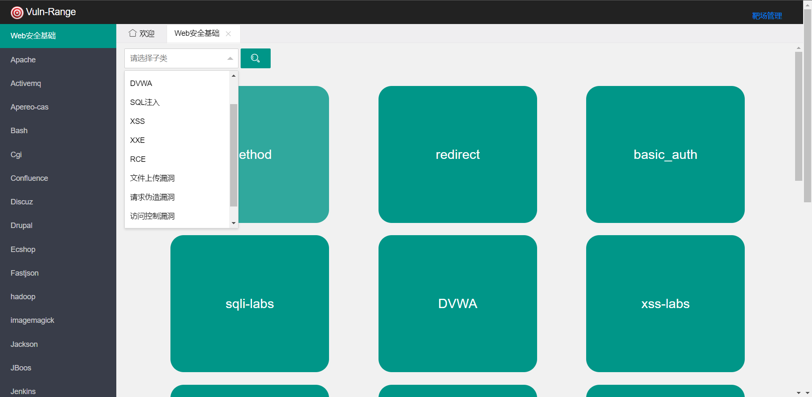
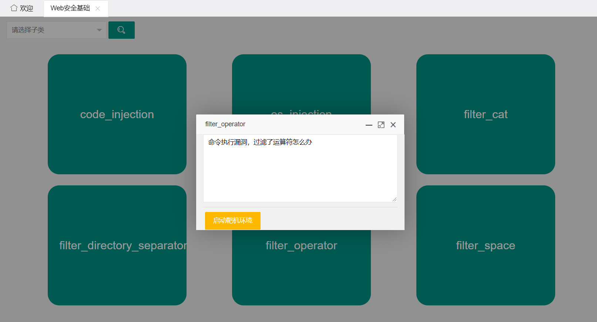
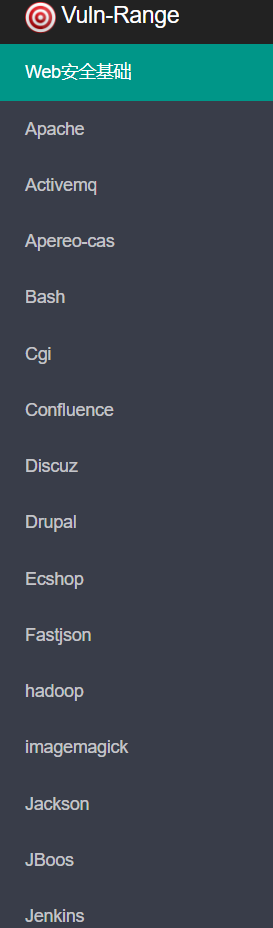
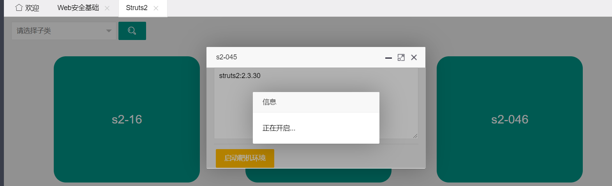
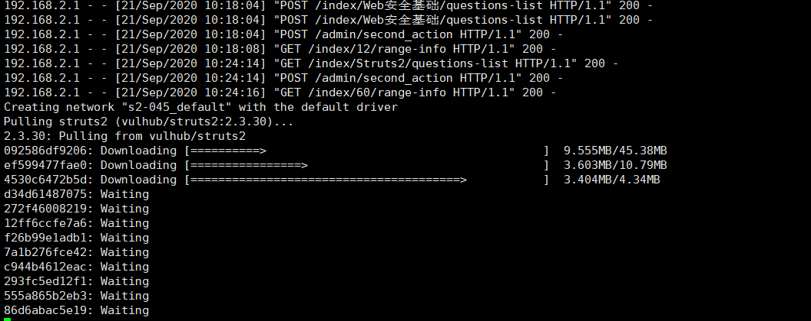
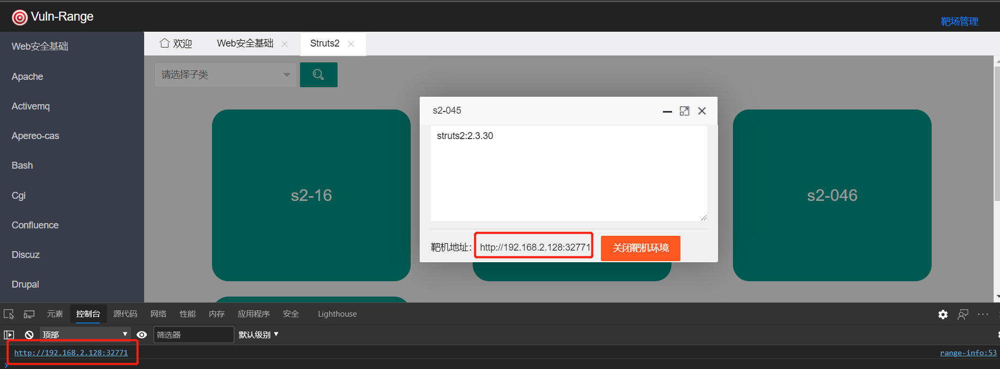

> **VulnRange的定位是一个漏洞靶场，用于快速的启动漏洞环境，便于漏洞复现和研究**

# 安装部署🚀

## 环境配置

**以Centos为例**

1、[Centos安装python3.8和PIP](https://www.cnblogs.com/wintrysec/p/11963807.html)

2、安装docker和docker-compose [把docker源换掉，推荐阿里云的源]

3、关闭防火墙和SELinux

## 下载安装VulnRange

```bash
git clone https://github.com/wgpsec/VulnRange.git
cd VulnRange
pip install -e . -i https://pypi.tuna.tsinghua.edu.cn/simple/	#安装项目
```

# 功能介绍:memo:

**启动**

```bash
#进入项目根目录下启动项目即可
cd ~/VulnRange
sh start.sh
```

## Web安全基础靶场





集合了常见的Web安全漏洞，多数是直接拉取开源的靶场环境，比如DVWA、sqli-labs、upload-labs

## 组件靶场分类

以组件名称分类展示各个中间件和CMS的靶场环境



## 开启靶机

点击 "启动靶机环境" 即可开启相关靶机。



等的时间过长的话可以切换到系统中看看环境构建进度



靶机环境构建完成后，点击链接即可访问



# 注意事项

> 1. 项目需要放到 `~/`  当前用户目录下
> 2. ubuntu 需要将`start.sh`中的`~/`改为绝对路径，如`/home/ubuntu`
> 3. 关闭Linux防火墙后请重启docker

